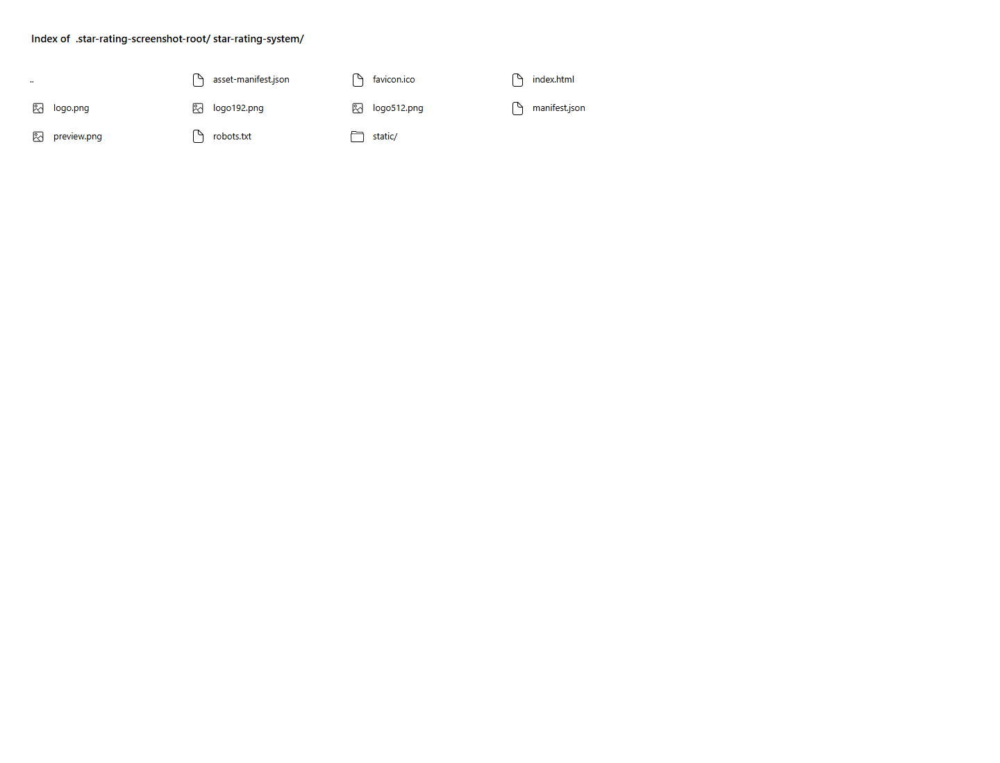

# Star Rating System

A responsive React star rating component with hover preview, keyboard-friendly controls, and a clear selected score.

## Features

- Hover across five stars to preview a rating
- Click or focus a star to select a score
- Accessible buttons with labels and selected states
- Responsive portfolio-style layout
- Floating go-to-top control with smooth scrolling
- Fixed header, icon-only footer links, and local project assets

## Tech stack

React, Create React App, Sass modules, and React Icons.

## Run locally

~~~
npm install
npm start
~~~

## Deployment

Live site: [a2rp.github.io/star-rating-system](https://a2rp.github.io/star-rating-system/)

Build and deploy:

~~~
npm run lint
npm run build
npm run deploy
~~~

## Screenshot

## Links

- [Portfolio](https://www.ashishranjan.net/)
- [GitHub](https://github.com/a2rp)
- [CodePen](https://codepen.io/ash1198)
- [LinkedIn](https://www.linkedin.com/in/aashishranjan)
- [Facebook](https://www.facebook.com/theash.ashish/)
- [YouTube](https://www.youtube.com/@ashishranjan-ashz?sub_confirmation=1)
- [Email](mailto:ash.ranjan09@gmail.com)

## Support

- [Support](https://a2rp-donation-page.netlify.app/)
- [Buy Me a Coffee](https://buymeacoffee.com/a2rp)
- [Patreon](https://patreon.com/a2rp)